Pub/Sub同様のミドルウエアサービスサーバー簡易システム、設計から実装までだいたい１０時間です。

test url:
1. Publisher topic register:  http://localhost:8080/topic/register?userName=pub_1&topicName=topic_1
1. Publisher message publish:  http://localhost:8080/message/publish?userName=pub_1&topicName=topic_1&message=message01
1. Subscriber topic subscribe:  http://localhost:8080/topic/subscribe?userName=sub1&topicName=topic_1
1. Subscriber message get:  http://localhost:8080/message/get?userName=sub1&topicName=topic_1
1. Subscriber message ack:  http://localhost:8080/message/ack?userName=sub1&topicName=topic_1
   

### 簡易設計図:

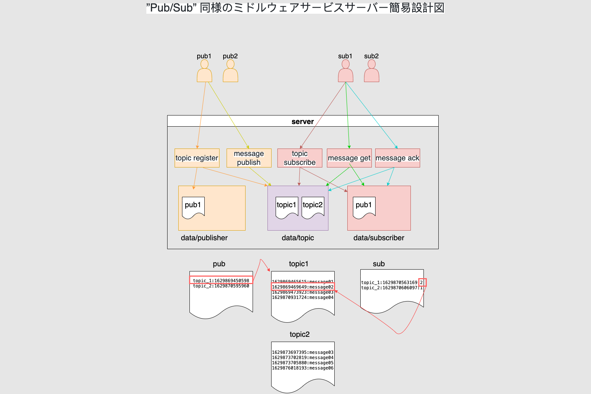

### プログラム起動:

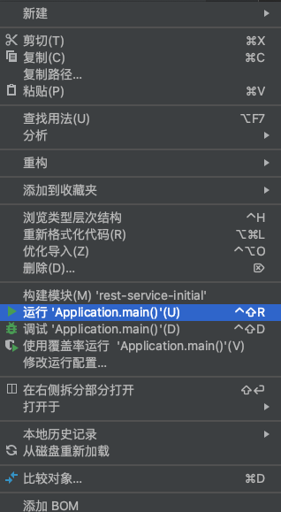

### 画面打健テスト:
1. Publisher topic register: 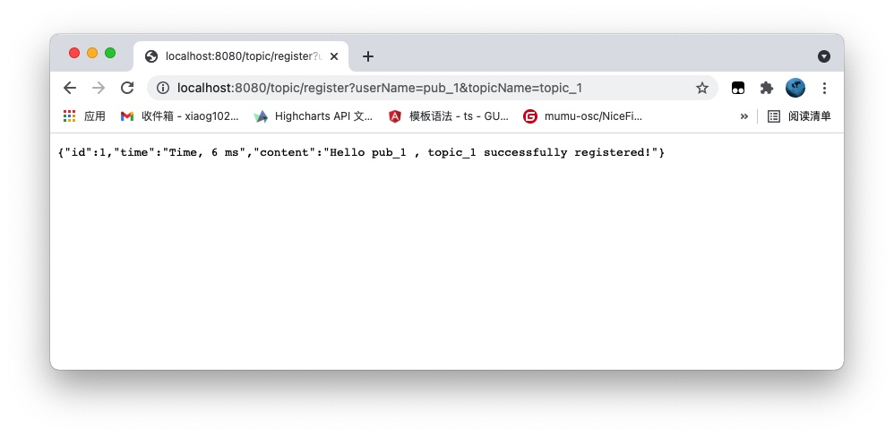
1. Publisher message01 publish: 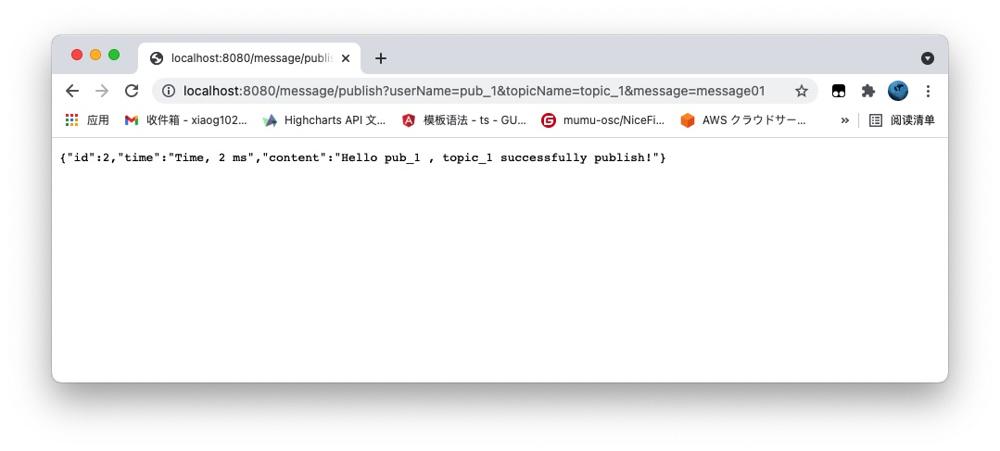
1. Publisher message02 publish: 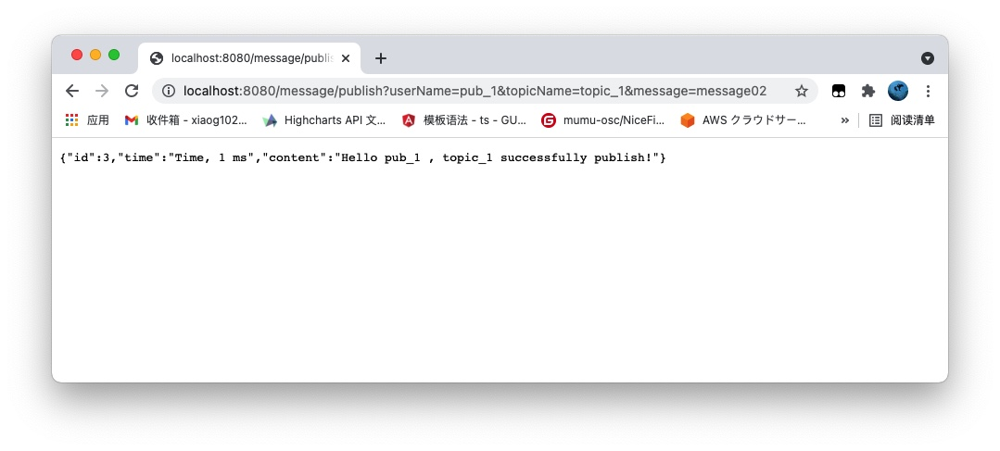
1. Publisher message03 publish: 
1. Subscriber topic subscribe: 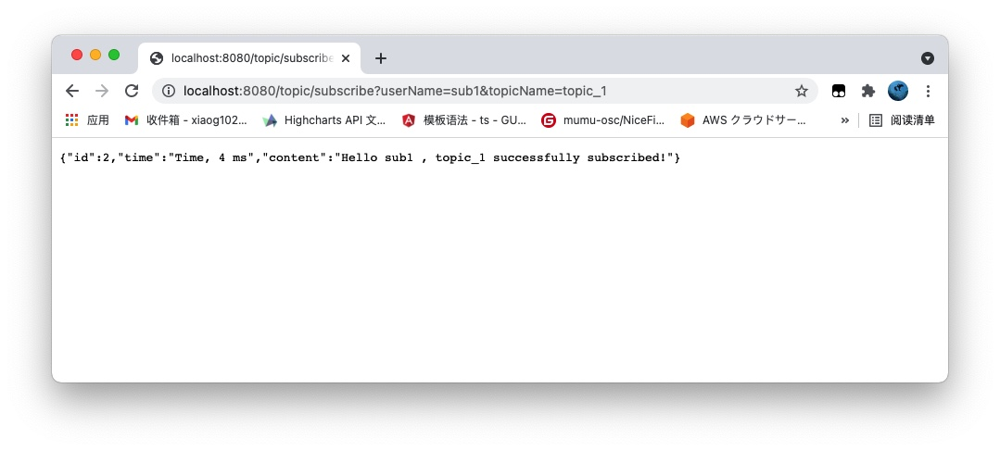
1. Subscriber message get: 
1. Publisher message04 publish: 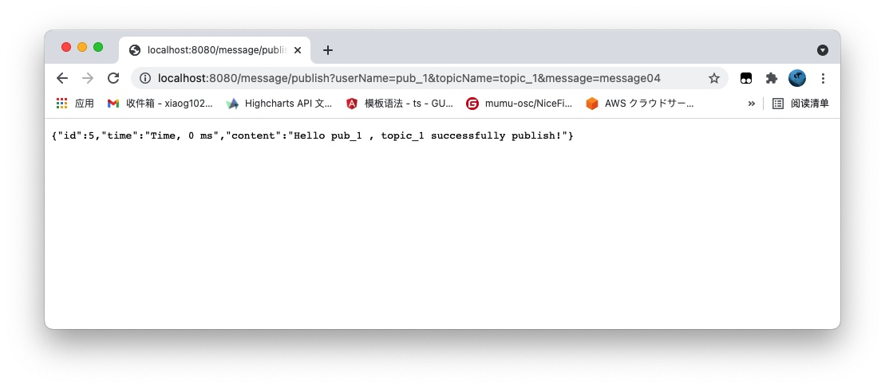
1. Publisher message05 publish: 
1. Subscriber message get: 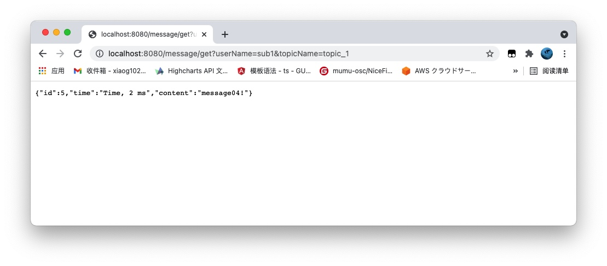
1. Subscriber message ack: 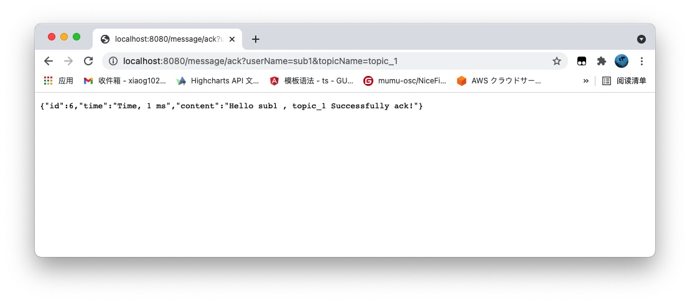
1. Subscriber message get: 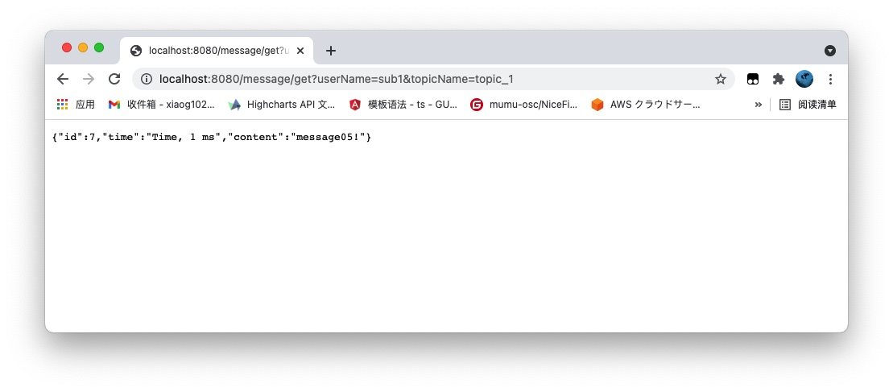
1. Subscriber message ack: 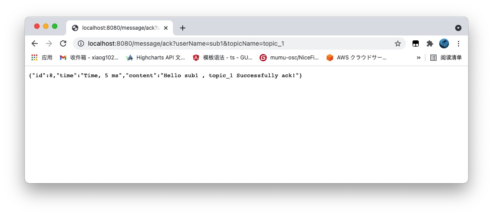
1. Subscriber message get: 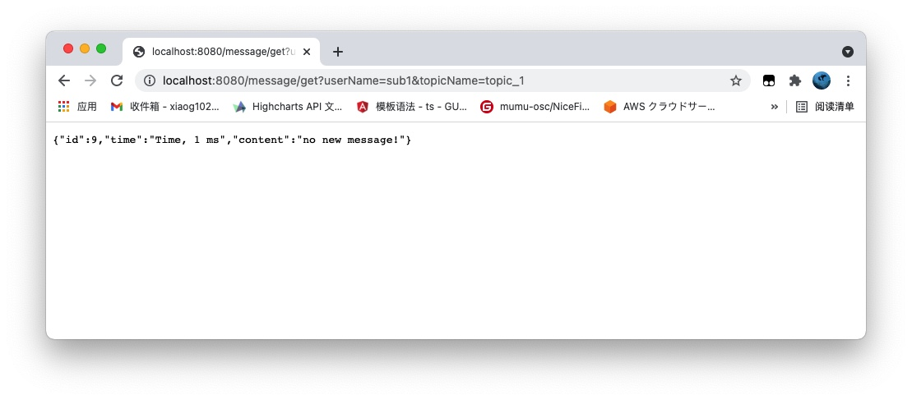

